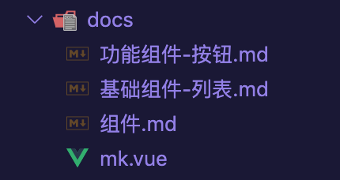
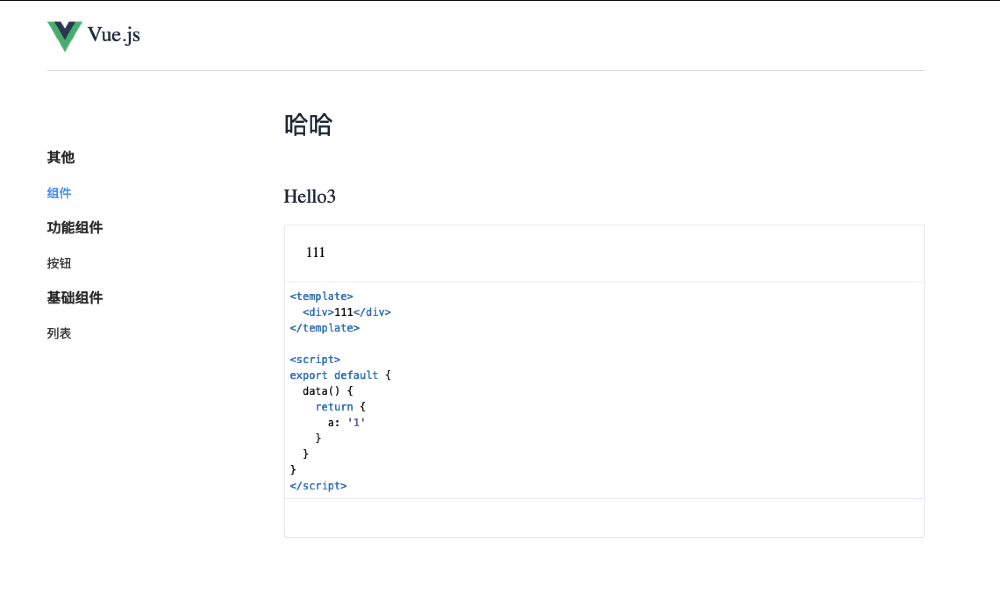

# vue-components-doc

本项目是项目内 `vue` 组件通过 `markdown` 方式生成组件文档的具体使用，可按照下面的方式接入项目中。

## 示例说明

命令 | 说明
--|--
yarn serve | 启动项目开发编译
yarn build | 启动项目生产编译

## 项目接入

1. 将 `build/markdown-loader` 拷入需要接入的项目中

2. 在 `webpack` 配置中增加如下配置：

```js
const VueLoaderPlugin = require('vue-loader/lib/plugin');

module.exports = {
  module: {
    rules: [
      {
        test: /\.vue$/,
        loader: 'vue-loader'
      },
      {
        test: /\.md$/,
        use: [
          {
            loader: 'vue-loader'
          },
          {
            loader: 'path/markdown-loader'
          }
        ]
      }
    ]
  },
  plugins: [new VueLoaderPlugin()]
};
```
使用 `vue-cli` 则需要在 `vue.config.js` 增加下面的配置:

```js
chainWebpack: config => {
  config.module.rule('md')
    .test(/\.md$/)
    .use('vue-loader')
    .loader('vue-loader')
    .options({
      compilerOptions: {
        preserveWhitespace: false
      }
    })
    .end()

    .use('markdown-loader')
    .loader('path/markdown-loader')
    .end()
}
```

3. 项目增加 `.eslintignore`，并忽略 `markdown` 文件的校验：`*.md`

4. src 目录拷贝到项目中，并自行处理命名上的冲突，以及重新配置入口指定。

```
.
├── App.vue
├── assets
│   └── logo.png
├── components
│   ├── blank.vue
│   ├── demo-block.vue
│   ├── header.vue
│   └── nav.vue
├── main.js
└── router.js
```

## 效果展示


